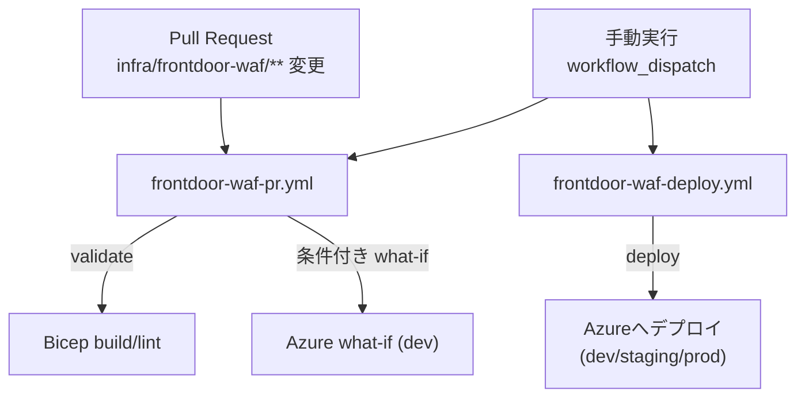
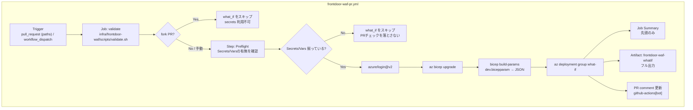

# GitHub Actions / CI (このリポジトリ)

このフォルダ（`.github/actions/`）は、本来 **Composite Action（再利用可能なAction）** を配置するための場所です。

このリポジトリでは現時点でComposite Actionは未作成のため、**CI/CD の全体像と運用方法のドキュメント置き場**として `README.md` を置いています。

- ワークフロー定義: `.github/workflows/`
- IaC（Front Door WAF）: `infra/frontdoor-waf/`

---

## いま動いている主なCI/CD（Front Door WAF）

Front Door (Standard/Premium) 向けの WAF ポリシーを Bicep で管理するため、次の2つが中心です。

#### 概念図（全体）

### PRチェック: `frontdoor-waf-pr.yml`

ファイル: `.github/workflows/frontdoor-waf-pr.yml`

#### 目的

- PRの段階で **Bicep の build / lint** を行い、テンプレート破損を早期に検出します。
- 追加で条件が揃っている場合、dev環境向けに **Azure Resource Group デプロイの what-if** を実行し、差分をPRに可視化します。

#### トリガー

- `pull_request`（対象パスに変更がある場合のみ）
  - `infra/frontdoor-waf/**`
  - `.github/workflows/frontdoor-waf-pr.yml`
- `workflow_dispatch`（手動実行）

#### 実行内容（ジョブ）

- `validate`（常に実行）
  - `infra/frontdoor-waf/scripts/validate.sh` を実行
  - Bicep の build/lint と、`.bicepparam` の検証（スクリプト内）

- `what_if`（dev / 条件付き）
  - fork PRでは secrets が利用できないため、**fork PR の場合は自動スキップ**します。
  - さらに、Secrets/Vars が未設定の場合も PR チェックを落とし続けないよう、**Preflight で検知してスキップ**します。
  - 実行できる場合は以下を実施します。
    - `azure/login@v2` でログイン
    - `az bicep upgrade`
    - `bicep build-params` で dev の bicepparam を JSON へ変換
    - `az deployment group what-if` を実行
    - 結果を以下へ出力
      - Job Summary（先頭のみ）
      - PRコメント（既存コメントを更新）
      - artifact（フル出力）: `frontdoor-waf-whatif`

#### 必要なGitHub設定（what-ifを有効化する場合）

Secrets（推奨は共通1つ）

- `AZURE_CREDENTIALS`（推奨）
  - 使えない場合はdev専用: `AZURE_CRED_DEV`

Repository Variables（dev）

- `AZURE_WAF_RESOURCE_GROUP_DEV`（推奨）
  - 互換フォールバックとして、ワークフローは以下も参照します
    - `AZURE_RESOURCE_GROUP_WAF_DEV`
    - `WAF_RESOURCE_GROUP_DEV`

> secrets/vars が未設定でも `validate` は実行され、`what_if` はスキップされます（PRを不要に赤くしない設計）。

---

### 手動デプロイ（承認ゲート付き）: `frontdoor-waf-deploy.yml`

ファイル: `.github/workflows/frontdoor-waf-deploy.yml`

#### 目的

- dev / staging / prod を選択して、Front Door WAF の Bicep を **Azure Resource Group にデプロイ**します。
- prod は特に、GitHub Environments の **required reviewers** で承認ゲートをかける前提です。

#### トリガー

- `workflow_dispatch` のみ（手動実行）
  - input: `environment`（`dev` / `staging` / `prod`）

#### GitHub Environment（承認ゲート）

ワークフロー側で次のEnvironment名を参照します。

- dev: `waf-dev`
- staging: `waf-staging`
- prod: `waf-prod`

GitHub 側（Repo Settings → Environments）で上記を作成し、必要に応じて **required reviewers** を設定してください。

#### 必要なGitHub設定（デプロイ）

```mermaid
flowchart TD
  subgraph WF[frontdoor-waf-deploy.yml]
    T["Trigger: workflow_dispatch<br/>input: environment=dev|staging|prod"];
    T --> G["GitHub Environment gate<br/>waf-dev / waf-staging / waf-prod"];
    G --> RESOLVE["Resolve target settings<br/>PARAM_SOURCE_FILE / AZURE_RESOURCE_GROUP"];
    RESOLVE --> PRE["Preflight<br/>RGとパラメータファイルの存在確認"];
    PRE --> LOGIN["azure/login@v2<br/>環境別 creds"];
    LOGIN --> BICEP["az bicep upgrade"];
    BICEP --> PARAM["bicep build-params<br/>.bicepparam → parameters.json"];
    PARAM --> DEPLOY["az deployment group create"];
    DEPLOY --> ART["Artifact upload<br/>frontdoor-waf-deploy-..."];
  end
```

Secrets（推奨は共通1つ）

- `AZURE_CREDENTIALS`（推奨）
  - 使えない場合は環境別: `AZURE_CRED_DEV` / `AZURE_CRED_STAGING` / `AZURE_CRED_PROD`

Repository Variables（Resource Group）

- `AZURE_WAF_RESOURCE_GROUP_DEV`
- `AZURE_WAF_RESOURCE_GROUP_STAGING`
- `AZURE_WAF_RESOURCE_GROUP_PROD`

（互換フォールバックとして `AZURE_RESOURCE_GROUP_WAF_*` / `WAF_RESOURCE_GROUP_*` も参照しますが、上記の `AZURE_WAF_RESOURCE_GROUP_*` を推奨します）

#### 成果物

- artifact: `frontdoor-waf-deploy-${environment}-${run_number}`
  - `infra/frontdoor-waf/.out/` 配下（コンパイル済み parameters など）をアップロードします。

---

## ローカル検証（手元でCI相当を回す）

`infra/frontdoor-waf/scripts/validate.sh` を使うと、CIの `validate` と同等の検証ができます。

- 参照: `infra/frontdoor-waf/README.md`

---

## 補足: `.github/workflows/` にあるその他のワークフローについて

`backend-deploy.yml` / `frontend-deploy.yml` / `infra-deploy.yml` が同居していますが、現状のワークスペースには `backend/`・`frontend/`・`infra/main.bicep` 等が存在しないため、**このリポジトリ構成のままでは手動実行すると失敗**します。

ただし、これらは `push` トリガーが `backend/**` や `frontend/**` の変更に限定されているため、通常の変更で勝手に動くことはありません。

- もし将来それらのディレクトリを追加して運用する場合は、
  - 対象ディレクトリの追加
  - Secrets/Vars（ACR や Container Apps 関連）の整備
  - もしくはワークフロー削除/移設

…のいずれかを行って、ワークフローと実体の整合を取ってください。
